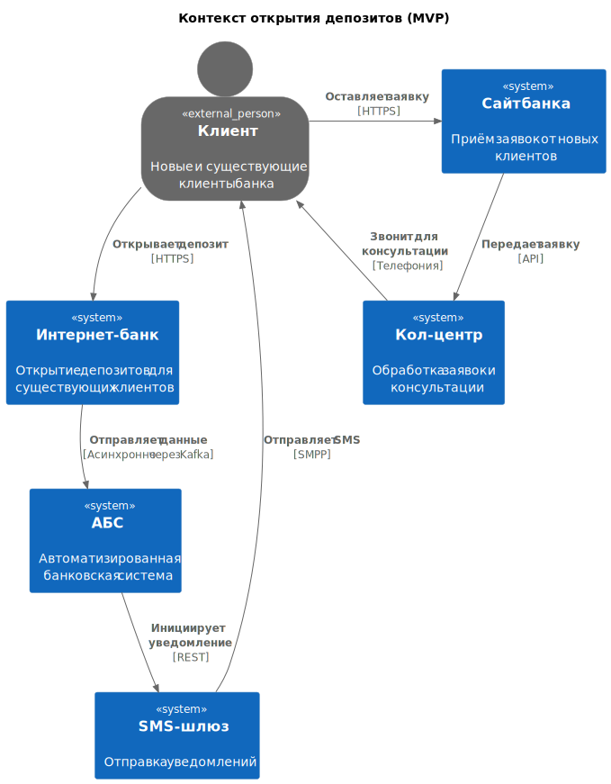
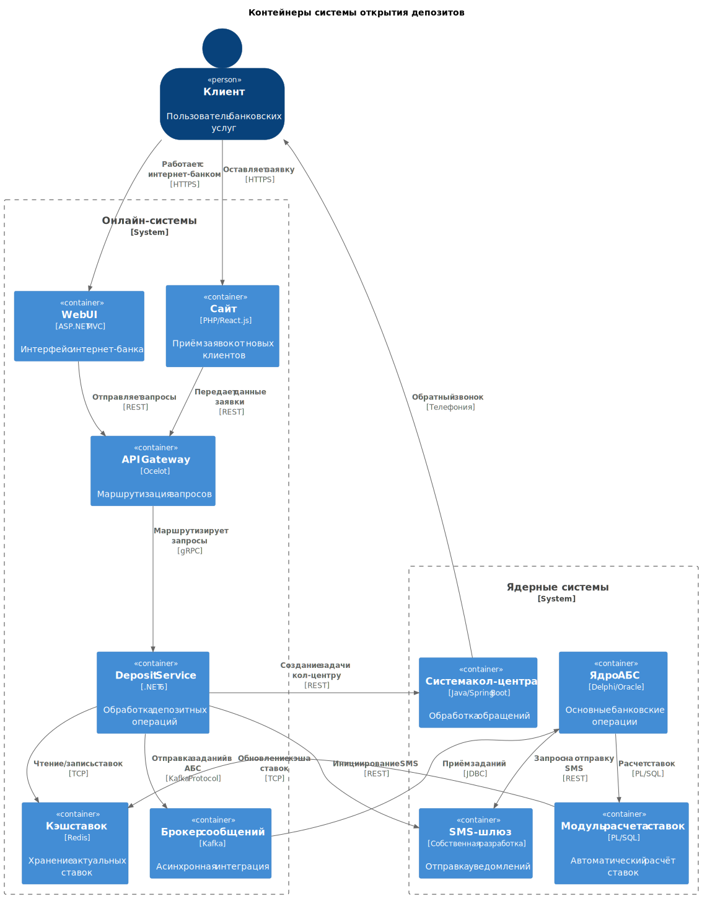

### **Название задачи: Концептуальная архитектура MVP для цифровизации открытия депозитов** 
### **Автор: Команда цифровой трансформации**
### **Дата: 20.07.2025**
### **Функциональные требования**

| **№** | **Действующие лица или системы** | **Use Case**                       | **Описание**                                                             |
|:-----:|:---------------------------------|:-----------------------------------|:-------------------------------------------------------------------------|
|   1   | Новый клиент                     | Подача заявки через сайт           | Клиент оставляет ФИО и телефон. Заявка передаётся в кол-центр            |
|   2   | Существующий клиент              | Открытие депозита в интернет-банке | Выбор счёта/суммы → SMS-подтверждение → Автоматический расчёт ставки     |
|   3   | Сотрудник бэк-офиса              | Обработка заявки в АБС             | Ручное подтверждение условий → Открытие депозита → Инициация уведомления |
|   4   | Система кол-центра               | Обратный звонок новому клиенту     | Получение заявки с сайта → Звонок → Консультация → Запись в отделение    |
|   5   | АБС                              | Автоматический расчёт ставок       | Интеграция с данными ЦБ и кредитными рисками → Обновление ставок в кэше  |

### **Нефункциональные требования**

| **№** | **Требование**                                             |
|:-----:|:-----------------------------------------------------------|
|   1   | Шифрование трафика (TLS 1.3+) для сайта/интернет-банка     |
|   2   | Доступность 99.9% (мульти-ЦОД архитектура)                 |
|   3   | Время отклика UI < 500 мс (кэширование справочников)       |
|   4   | Асинхронная интеграция с АБС через Kafka                   |
|   5   | Защита от перегрузки АБС (API Gateway + rate limiting)     |
|   6   | Использование текущих технологий: C#, Java, MS SQL, Oracle |
|   7   | Автоматическая доставка SMS/email-уведомлений              |
### **Решение**

Данная архитектура обеспечивает баланс между
- Скоростью внедрения MVP
- Масштабируемостью решения
- Соблюдением ограничений существующей IT-инфраструктуры
- Выполнением нефункциональных требований

### **Альтернативы**
Вариант 1: Прямая интеграция с АБС

Недостатки
- Риск перегрузки АБС (ограничение вертикального масштабирования)
- Нет буферизации пиковых нагрузок
- Нарушение требования R1 из FURPS+

Вариант 2: Дооборудование монолита интернет-банка

Недостатки
- Зависимость от подрядчика для обновлений
- Сложность внедрения современных технологий
- Невозможность независимого масштабирования

**Недостатки, ограничения, риски**

Недостатки выбранного решения

- Сложность внедрения Kafka (требует обучения команды)
- Двойная обработка данных (кэш Redis и АБС)

Ограничения

- Вертикальное масштабирование АБС (апгрейд серверов Oracle)
- Совместимость только с C#/Java (запрет на Golang/Python)

Риски

- Перегрузка Kafka 
- Задержки синхронизации кэша 
- Сбои при интеграции с АБС

Компромиссы

- Отложенная миграция на микросервисы: Только для депозитов, остальные продукты - в монолите
- Ручная обработка в MVP: Бэк-офис участвует для минимизации рисков
