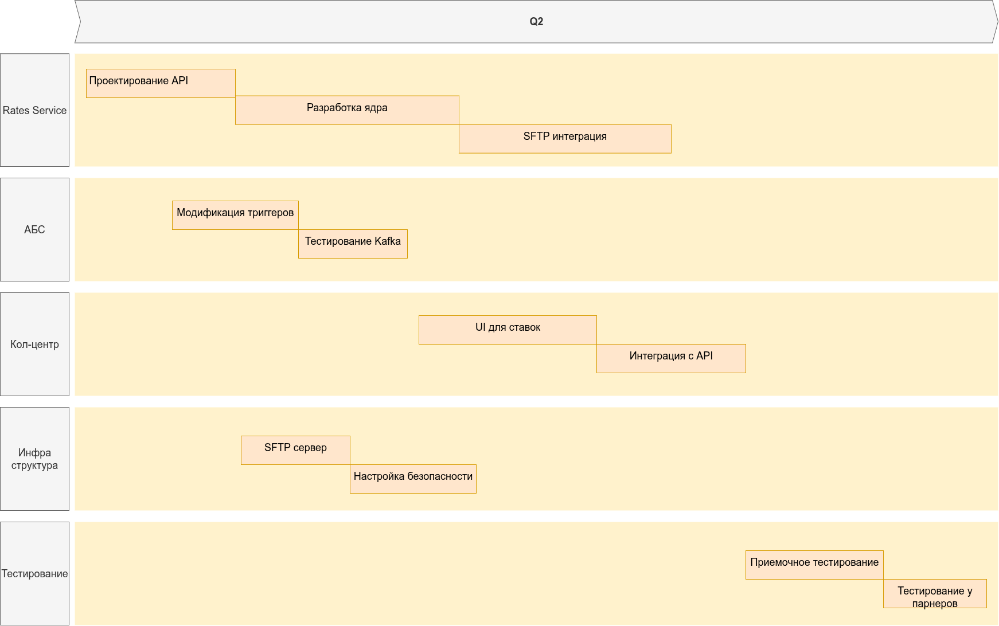

### **Название задачи: Интеграция кол-центров с системой актуальных депозитных ставок** 
### **Автор: Команда цифровой трансформации**
### **Дата: 20.07.2025**
### **Функциональные требования**

| **№** | **Действующие лица или системы** | **Use Case**                        | **Описание**                                               |
|:-----:|:---------------------------------|:------------------------------------|:-----------------------------------------------------------|
|   1   | Сотрудник внутреннего кол-центра | Консультация по ставкам             | Доступ к актуальным ставкам в реальном времени через API   |
|   2   | Система партнерского кол-центра  | Получение файла со ставками         | Автоматическая загрузка файла через SFTP каждые 5 минут    |
|   3   | Модуль расчета ставок (АБС)      | Генерация файла для партнера        | Формирование encrypted CSV файла с полным списком ставок   |
|   4   | Rates Service                    | Управление ставками для кол-центров | Синхронизация данных между АБС, Redis и внешними системами |
|   5   | Администратор                    | Настройка SFTP                      | Конфигурирование доступа для партнерского кол-центра       |
### **Нефункциональные требования**

| **№** | **Требование**                                             |
|:-----:|:-----------------------------------------------------------|
|   1   | Обновление ставок в кол-центрах каждые 5 минут             |
|   2   | Шифрование файлов (AES-256) для партнеров                  |
|   3   | REST API с rate limiter. 100 RPC для каждого пода          |
|   4   | Совместимость с Java 11 (система кол-центра)               |
|   5   | Логирование всех операций с файлами                        |
|   6   | Разделение доступа: партнеры видят только публичные ставки |
### **Решение**

Логика решения:
- Единый источник ставок
- Все ставки генерируются в АБС → синхронизируются в Redis через Kafka

Гарантирует консистентность данных во всех системах
- Двойной канал доставки
- REST API для внутреннего кол-центра (низкая задержка)
- SFTP для партнеров (совместимость с legacy-системами)

Механизм безопасности
- Шифрование файлов (PGP/GPG)
- IP-фильтрация на SFTP сервере 
- OAuth 2.0 для API

### **Альтернативы**
Вариант 1: Прямой доступ к АБС

Недостатки:
- Риск перегрузки АБС
- Нарушение изоляции ядра
- Нет поддержки партнеров

Вариант 2: Единый REST API для всех

Недостатки:
- Требует модификации внешней системы
- Не соответствует ТЗ (только файловый обмен)
- Риски безопасности

**Недостатки, ограничения, риски**

Недостатки:
- Задержка до 5 минут для партнеров
- Дублирование данных (кэш + файлы)

Ограничения:
- Только SFTP для партнерских кол-центров	
- Частота обновлений: раз в 5 минут для АБС

Риски:
- Утечка файлов
- Перегрузка API
- Расхождение ставок
